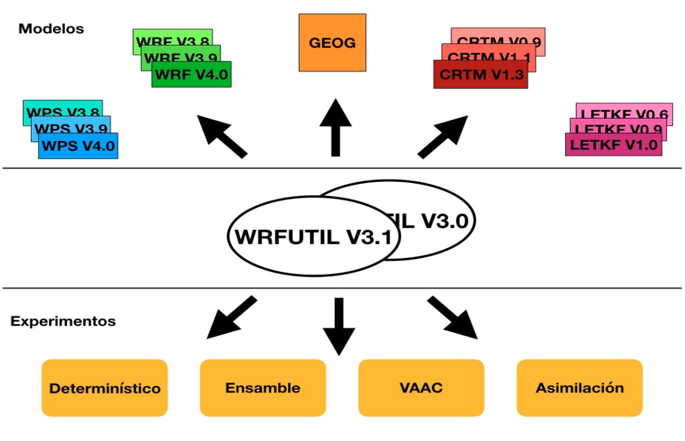
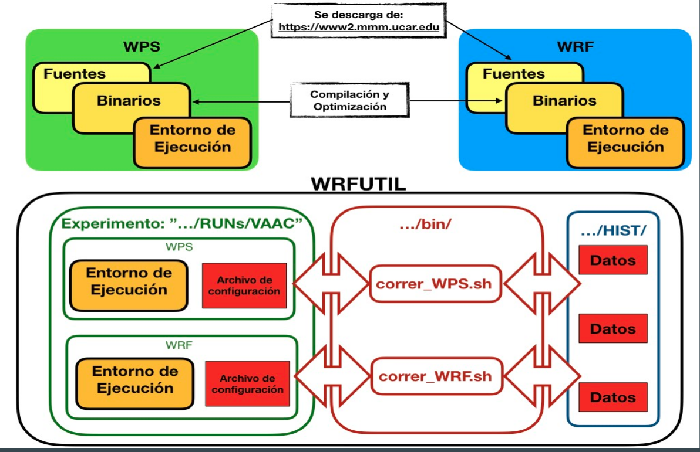

# WRFUTIL
Sistema de pronóstico operativo para el Servicio Meteorológico Nacional Desarrollado por equipo de DMSR.

Esta herramienta consiste en un conjunto de scripts de bash y pyhton que permite la rápida implementación de un sistema de pronostico determinístico y probabilístico basado en el model WRF y asimilación de datos utilizando el modelo LETKF   

Implementa el concepto abstracto de Pronóstico Numérico Operativo en **Experimentos**. Así, un experimento es una concreción de un pronostico determinado caracterizado por su dominio (espacial y temporal), tipo (determinístico, probabilístico, asimilación de datos) y su postproceso.

Entonces, cada experimento es independiente del resto en referencia al Modelo de Pronostico (WRF) y versión; y autónomo en el sentido que contiene todas las referencias necesarias para ejecutar correctamente.

Los scripts de WRFUTIL interactúan con los experimentos, proveyendoles de datos de inicialización y almacenando sus resultados en un repositorio común (HIST) de manera que los experimentos puedan colaborar entre sí.

##### Características Generales

 * **independiza** los experimentos de la Versión/Compilación de los modelos
 * facilita la **escalabilidad** de cómputo con independencia del HW de base
 * **flexibilidad** de ejecución y control de flujo articulado mediante  tareas atómicas
 * sistema parametrizado de códigos y mensajes  de error  que permite la construcción de ejecuciones **robustas** con recuperación frente a errores.
 * configuración **centralizada**
 * completa **integración** con cualquier sistema de colas mediante plugins
 * **control de flujo** programable integrado (opcional)

##### Estructura General
Los siguientes directorios contienen los fuentes y templates del wrfutil. Esta es la estructura del repositorio previo a la instalación
  * **bin** Repositorio de scripts de bash de ejecución
   * **python** Repositorio de script de python
  * **lib** Repositorio de funciones auxiliares
  * **namelists** Repositorio de templates de archivos de configuración de pronostico de distintos modelos
  * **templates** Otros templates de configuración
  * **vtables** Repositorios de Vtables disponibles

Luego de la instalación se generan los siguientes directorios
  * **RUNs** Repositorio de los experimentos que se definan
   * **HIST** Repositorio de datos (Historicos) de los experimentos
  * **WRFs** Repositorio de modelos WRF integrados al sistema mediante la herramienta *replicarWRF.sh*
  * **WPSs** Repositorio de modelos WPS integrados al sistema mediante la herramienta *replicarWPS.sh*
  * **CRTMs** Repositorio de modelos CRTM integrados al sistema mediante la herramienta *replicarCRTM.sh*
  * LETKFs Repositorio de modelos LETKF integrados al sistema mediante la herramienta *replicarLETKF.sh*

El esquema del repositorio de datos históricos  **RUNs/HIST/** es el siguiente:
  * **FCST** Repositorio de WRFOUT
  * **POST** Repositorio de datos post-procesados
  * **GFS** Repositorio de GFS
  * **PLOT** Repositorio de cartas de pronostico
  * **ANA** Repositorio de analisis generados mediante asimilacion de datos
  * **LOGS** Log general del Sistema

Dentro del esquema general, cada pronostico almacenara sus datos con la misma estructura:

     <AAAAMMDD_HHmmss>/<experimento>/<id de miembro>/
 Por ejemplo, el archivo de wrfout (wrf_xxx.nc) correspondiente a la fecha de inicialización 12 de Marzo del 2018 y hora 6AM generado por el experimento ***deterministico*** sera almacenado en:

     RUNs/HIST/FCST/20180312_060000/deerministico/00/wrf_xxx.nc

## Instalación
Requisitos previos a la instalación del wrfutil.
  * Ver instalación de [WRF](./DOCs/README_WRF.md)
  * ver instalación de [CRTM](https://gitlab.smn.gob.ar/ID/CRTM-2.3.0)
  * Ver instalación de [ISS](https://gitlab.smn.gob.ar/ID/ISS-SMN)
  * Ver instalación de [LETKF](https://gitlab.smn.gob.ar/ID/LETKF_WRF_SMN)
  * Ver instalación de [QC-RADAR](https://gitlab.smn.gob.ar/ID/qc-radarV1.0)
  * Ademas debe estar instalado y funcional el administrador de paquetes de conda

Para instalar ***wrfutil*** en un sistema simplemente se debe clonar este git en el directorio deseado:

     export GEOGRIDDIR=<path absoluto a la base de datos del goegrid>
     export GFSDIR=<path absoluto al repositorio de GFS>
     export GFSCAL=<path absoluto al repositorio de GFS para calibracion>

     cd <path de instalación>
     git clone https://gitlab.smn.gov.ar/ID/wrfutilV3.1.git
     cd wrfutilV3.1
     export WRFUTILDIR=$(pwd)
     ./bin/install.sh   $GEOGRIDDIR $GFSDIR $GFSCAL

Luego verifique que el archivo *\$WRFUTILDIR/config.env* contenga definiciones correctas para sus sitema y en caso contrario, modifique lo que sea necesario.

##### Incorporación de Modelos
Para que cualquier experimento pueda usar una versión/compilación  determinada de un modelo, previamente se lo debe incorporar al ámbito del ***wrfutil***, por ejemplo:

###### incorporar una versión de WRF
     $WRFUTILDIR/bin/replicarWRF.sh <nombre id interno> <path a la version> <archivo configuracion librerias>
###### incorporar una versión de WPS
     $WRFUTILDIR/bin/replicarWPS.sh <nombre id interno> <path a la version> <archivo configuracion librerias>
###### incorporar una versión de CRTM
     $WRFUTILDIR/bin/replicarCRTM.sh <nombre id interno> <path a la version> <path a la version del ISS> <archivo configuracion librerias>
###### incorporar una versión de LETKF
     $WRFUTILDIR/bin/replicarLETKF.sh <nombre id interno> <path al letkf.exe> <path al WRFDA> <archivo configuracion librerias>

Verifique que para cada versión incorporada exista un archivo *\*.tar* en el directorio correspondiente al modelo.

## Uso
El concepto fundamental de uso del wrfutil es el experimento. Un experimento define un sistema de pronostico y ademas es el espacio donde se ejecutan y configuran todos los pasos necesarios para llevar a cabo dicho pronostico.
Entonces, luego de una instalación exitosa, el siguiente paso es la creación de un experimento.
###### Creación de un Experimento
Para correr un pronóstico deerminístico o probabilístico, ejecutar:    

    $WRFUTILDIR/bin/crearExpFCST.sh < nuevo nombre experimento > < version WPS > < version WRF >
Si desea crear un experimento para asimilacion de datos ejecute:    

    $WRFUTILDIR/bin/crearExpASIM.sh < nuevo nombre entonro > < entorno WPS > < entorno WRF > [ entorno LETKF ]

Una vez creado un experimento hay que configurarlo para que se adapte a las necesidades buscadas.

###### Configuración de un Experimento
Un experimento esta totalmente definido por los siguientes archivos de configuraciones, ubicados en *\$WRFUTIDLDIR/RUNs/<experimento>*:

 * experimento.conf  
   * Define las características específicas del experimento: archivo donde se centraliza la información de las corridas
 * experimento.dirs
   * Define los path del entorno, no haría falta modificarlo
 * experimento.dep
   * Define las dependencias entre los correr*.sh para el sistema de colas. Se pueden eliminar estas dependencias y controlar el flujo a través de control-M
 * experimento.asim
   * Define las características para un experimentos de asimilación de datos
 * experimentos.plgin
   * En este archivo se configuran las funcionalidades configurables de los experimentos (Calibracion / ISS)
 * experimento.limp
   * Define los archivos que se quieren borrar o conservar del repositorio histórico.

###### Ejecución de un Pronóstico
En general, para realizar varias corridas inicializadas en distintos horarios, solo hay que modificar las variables **FECHA_INI** y **CICLO** en el experimento.conf

Actualización de fecha en *experimento.conf*

    FECHA_INI=$(date  +"%Y/%m/%d")
    CICLO=$1
    sed -i -e "/export FECHA_INI=/c\\exportFECHA_INI=\'$FECHA_INI\'"$WRFUTILDIR/RUNs/ensamble/    experimento.conf
    sed -i -e "/export CICLO=/c\\export CICLO=$CICLO" $WRFUTILDIR/RUNs/ensamble experimento.conf

Los archivos de configuración determinan el comportamiento de los *scripts de ejecución*, y cada script de ejecución avanza un paso en la concreción del sistema de pronóstico. Por ejemplo, un pronóstico probabilistico por ensamble podria realizarse siguiendo los siguientes pasos:

     $WRFUTILDIR/bin/correr_WPS.sh ensamble
     $WRFUTILDIR/bin/correr_Pert.sh ensamble
     $WRFUTILDIR/bin/correr_Real.sh ensamble
     $WRFUTILDIR/bin/correr_WRF.sh ensamble
     $WRFUTILDIR/bin/correr_Post.sh ensamble
     $WRFUTILDIR/bin/correr_Plot.sh ensamble
### Autores
 * Maximiliano A. Sacco,(msacco@smn.gob.ar) DMSR - SMN
 * Maria Eugenia Dillon,(mdillon@smnn.gob.ar) DMSR - SMN / CONICET
 * Yanina Garcia Skabar,(yanina@smn.gob.ar) DMSR - SMN / CONICET
 * Cynthia Matsudo,(matsudo@smn.gob.ar) DMSR - SMN
 * Federico Cutraro,(fcutraro@smn.gob.ar) DMSR - SMN
